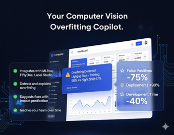

# 🔍 DeepSight - Debugging Copilot for Computer Vision

[](https://www.python.org/downloads/)
[](LICENSE)
[](https://mlflow.org/)
[](https://pytorch.org/)

<div align="center">
  
</div>

**DeepSight** is an copilot designed to provide systematic guidance for computer vision model training, debugging, and overfitting analysis. It integrates seamlessly with popular MLOps tools to deliver actionable insights through automated testing, research assistance, and comprehensive reporting.

## 🎯 Key Features

### 🤖 **DeepSight Advisor - Unified Orchestrator**
- **End-to-End Analysis**: Complete ML analysis pipeline from artifact loading to AI-powered insights
- **Multiple Configuration Methods**: Simple convenience functions, config objects, or dictionary-based setup
- **Automated Workflow**: Intelligent orchestration of artifact loading, analysis
- **Comprehensive Logging**: Detailed progress tracking and execution monitoring
- **Flexible Output**: Configurable result saving in multiple formats (JSON, YAML, text)

### 🔬 **Intelligent Model Analysis**
- **Overfitting Detection**: Automated detection and analysis of overfitting patterns in CV models
- **Performance Monitoring**: Real-time tracking of training metrics with intelligent alerts
- **Learning Curve Analysis**: Advanced analysis of model behavior during training

### 🛠️ **MLOps Tool Integration**
- **MLflow Integration**: Seamless experiment tracking, model registry, and artifact management
- **Deepchecks Validation**: Automated model validation with computer vision-specific checks
- **DVC Support**: Data versioning and pipeline management integration
- **PyTorch Lightning**: Advanced training framework with built-in best practices
- **Cursor**: Direct integration with Cursor coding agent for guided code generation

### 📊 **Advanced Training Capabilities**
- **Classification Trainer**: Production-ready trainer with configurable hyperparameters
- **Multi-GPU Support**: Distributed training with automatic device detection
- **Model Zoo**: Pre-configured models including CLIP and TIMM architectures
- **Custom Datasets**: Built-in support for various CV datasets and formats

### 🔍 **Research Assistant & Query Generation**
- **Academic Paper Discovery**: Automated literature search based on model characteristics
- **Solution Recommendations**: Evidence-based suggestions for model improvement
- **Problem Classification**: Intelligent categorization of training issues
- **Intelligent Prompt Building**: AI-powered query generation from ML artifacts
- **Multi-Provider Support**: Integration with various AI IntelligenceProviders and LLMs

## 🚀 Quick Start

### Installation

```bash
# Clone the repository
git clone https://github.com/FadelMamar/deepsight.git
cd deepsight

# Install with uv (recommended)
uv sync
uv pip install -e .
```

### Basic Usage

#### 1. Start MLflow Tracking Server
```bash
# Launch MLflow server
./scripts/launch_mlflow.sh

# Or manually
mlflow server --host 0.0.0.0 --port 5000
```

#### 2. Quick Analysis with DeepSight Advisor
```python
from deepsight.core.advisor import run_analysis

# Run complete ML analysis pipeline
result = run_analysis(
    run_id="your_mlflow_run_id",
    tracking_uri="http://localhost:5000"
)

print(f"Analysis completed: {result.success}")
print(f"Execution time: {result.execution_time:.2f}s")
```

#### 3. Train a Classification Model
```python
from deepsight.zoo.foodwaste import load_train_and_val_datasets
from deepsight.zoo.trainers.classification import ClassificationTrainer, ClassificationTrainerConfig

# Load your datasets
train_dataset, val_dataset = load_train_and_val_datasets()

# Configure the trainer
config = ClassificationTrainerConfig(
    num_classes=train_dataset.num_classes,
    label_to_class_map=train_dataset.label_to_class_map,
    batch_size=16,
    epochs=10,
    lr=1e-3,
    experiment_name="my_cv_experiment",
    tracking_uri="http://localhost:5000"
)

# Train the model
trainer = ClassificationTrainer(config)
trainer.run(train_dataset=train_dataset, val_dataset=val_dataset)
```

#### 3. Run Model Validation Checks
```python
from deepsight.integrations import DeepchecksRunner
from deepsight.utils import DeepchecksConfig
from deepsight.core.data import ClassificationVisionDataLoader

# Configure validation checks
config = DeepchecksConfig(
    train_test_validation=True,
    data_integrity=True,
    model_evaluation=True,
    save_results=True,
    output_dir='results'
)

# Run comprehensive validation suite
runner = DeepchecksRunner(config)
results = runner.run_suites(train_data=train_data, test_data=test_data)
```

## 🏗️ Architecture

```
deepsight/
├── 📁 core/                    # Core analysis engine
│   ├── advisor/               # DeepSight Advisor orchestrator
│   │   ├── config.py          # Configuration management
│   │   ├── errors.py          # Error hierarchy
│   │   ├── orchestrator.py    # Main DeepSightAdvisor class
│   │   └── result.py          # Result data models
│   ├── artifacts/             # Artifact management system
│   │   ├── datamodel.py       # Artifact data models
│   │   ├── manager.py         # Artifact manager
│   │   ├── repository.py      # Artifact repository
│   │   └── services.py        # Artifact services
│   ├── data/                  # Data loading and processing
│   ├── query/                 # Query generation and intelligence
│   │   ├── builders/          # Prompt builders
│   │   │   ├── base.py        # Base builder classes
│   │   │   ├── config.py      # Builder configuration
│   │   │   ├── deepchecks.py  # Deepchecks prompt builder
│   │   │   ├── generator.py   # Query generator
│   │   │   └── training.py    # Training prompt builder
│   │   └── intelligence/      # AI intelligence integration
│   │       ├── client.py      # Intelligence client
│   │       ├── models.py      # Intelligence models
│   │       └── IntelligenceProviders/     # AI provider implementations
│   │           ├── base.py    # Base provider interface
│   │           ├── coding_agent/ # Coding agent IntelligenceProviders
│   │           └── llm/       # LLM IntelligenceProviders
├── 📁 integrations/            # External tool integrations
│   ├── cursor/                # Cursor AI integration
│   ├── deepchecks.py          # Deepchecks validation runner
│   ├── lightning.py           # PyTorch Lightning integration
│   └── mlflow.py              # MLflow experiment tracking
├── 📁 zoo/                     # Model zoo and trainers
│   ├── datasets/              # Dataset implementations
│   │   ├── food.py            # Food dataset
│   │   └── foodwaste.py       # Food waste dataset
│   ├── trainers/              # Training frameworks
│   │   └── classification.py  # Classification trainer
│   └── timm_models.py         # TIMM model integrations
├── 📁 utils/                   # Shared utilities
│   ├── config.py              # Configuration management
│   ├── logging.py             # Structured logging
│   └── validators.py          # Input validation
└── 📁 cli/                     # Command-line interface
    ├── main.py                # CLI entry point
    └── commands.py            # Command implementations
```

## 📦 Dependencies

### Core Technologies
- **Python 3.11+**: Modern Python features and performance
- **PyTorch 2.8.0**: Deep learning framework
- **PyTorch Lightning**: Advanced training framework
- **MLflow 3.3+**: Experiment tracking and model registry
- **Deepchecks**: Model validation and testing

### Computer Vision Stack
- **torchvision**: Image processing and models
- **timm**: State-of-the-art vision models
- **open-clip-torch**: CLIP model implementations
- **fiftyone**: Dataset visualization and management

### MLOps Tools
- **DVC**: Data version control
- **Hugging Face Hub**: Model and dataset hosting
- **OmegaConf**: Hierarchical configuration management

## 📊 Examples

Explore the `examples/` directory for comprehensive tutorials:

### 🤖 **DeepSight Advisor Examples**
- **`advisor_usage.py`**: Complete advisor workflow with multiple configuration methods
  ```bash
  # Quick analysis
  uv run examples/advisor_usage.py example_1
  
  # Full configuration
  uv run examples/advisor_usage.py example_2
  
  # Dictionary configuration
  uv run examples/advisor_usage.py example_3
  ```

### 🔧 **Core Component Examples**
- **`run_training.py`**: Complete training pipeline example
- **`run_suite_of_checks.py`**: Model validation workflow
- **`run_artifact_manager.py`**: Artifact management and retrieval
- **`build_prompts.py`**: Query generation from artifacts
- **`vision_dataloader.ipynb`**: Interactive data exploration notebook


## 🔬 Research & Citations

DeepSight incorporates cutting-edge research in computer vision and MLOps. If you use DeepSight in your research, please cite:

```bibtex
@software{deepsight2024,
  title={DeepSight: MLOps Copilot for Computer Vision},
  author={DeepSight Team},
  year={2024},
  url={https://github.com/your-org/deepsight}
}
```

## 📝 License

This project is licensed under the Apache License 2.0 - see the [LICENSE](LICENSE) file for details.

## 🆘 Support

- **Issues**: Report bugs and request features on [GitHub Issues](https://github.com/your-org/deepsight/issues)
- **Discussions**: Join the community on [GitHub Discussions](https://github.com/your-org/deepsight/discussions)
- **Email**: Contact the team at team@deepsight.ai

## 🌟 Acknowledgments

Special thanks to the open-source community and the following projects that make DeepSight possible:
- PyTorch and PyTorch Lightning teams
- MLflow community
- Deepchecks developers
- TIMM and OpenCLIP contributors

---

**Built with ❤️ for the Computer Vision and MLOps community**
